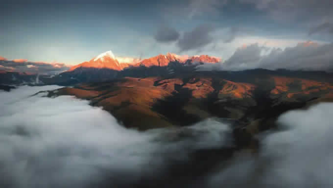

# JPEG Adjusted Encoder

## Basic Information
Implement a JPEG standard encoder supporting adjusted DHT, DQT algorithm, which gets better compression rate than default setting in JPEG annex.

## Run
Use `Makefile` to test.

```sh
make run    # execute sample code
make clean  # remove useless file
```

## Procedure
- Adjusted DHT
  1. Get stastistics of the converted image.
  2. Build the optimal huffman tree.
  3. Mapping the huffman tree to huffman table format in JPEG.
  4. If the huffman tree depth > 16, compress it to a shallower tree.

- Adjusted DQT
  1. Offline profile the error rate of default quantization table.
  2. Get stastistics of the converted image.
  3. Binary search to get the biggest quantization factors which reach the accepted error rate.

## Conversion API
```cpp
// The work is able to convert ppm image into jpeg image in 3 modes.

// standard JPEG
void convert_normal_jpeg(std::string &in_filename, std::string &out_filename);

// standard JPEG with adjusted huffman coding
void convert_adjusted_DHT_jpeg(std::string &in_filename, std::string &out_filename);

// standard JPEG with adjusted quantization factors
// scale parameter implies accepted error rate compared with default setting
void convert_adjusted_DQT_jpeg(std::string &in_filename, std::string &out_filename, float scale);
```

## Compression Rate

> File size showed in bytes.

| | PPM size | Standard JPEG | JPEG w/ adjusted DQT (scale=1.0) | JPEG w/ adjusted DHT |
| --- | --- | --- | --- | --- |
| small (8x8, only one block) | 203 (100.00%) | 623 (306.90%) | 622 (306.40%) | 270 (133.00%) |
| red (only single color) | 278k (100.00%) | 21k (7.46%) | 21k (7.46%) | 6k (2.04%) |
| test 1 | 790k (100.00%) | 66k (8.38%) | 65k (8.23%) | 3k (3.65%) |
| test 2 | 1219k (100.00%) | 116k (9.48%) | 120k (9.78%) | 66k (5.42%) |
| origin field (huge image) | 7373k (100.00%) | 730k (9.90%) | 878k (11.90%) | 455k (6.18%) |

- Only the small case, JPEG is worse than PPM. In this case, there is only one block, but lots of table information.
- Adjusted DQT has similar compression rate compared with original setting, but we can set higher scale (worse quality) to reach better compression rate.
- Adjusted DHT is much better than original setting. (around 2-3x)

## Compression Quality

| Standard JPEG | JPEG w/ adjusted DQT (scale=1.0) | JPEG w/ adjusted DHT |
| --- | --- | --- |
|  |  |  |

## Reference
[ITU-T81](https://www.w3.org/Graphics/JPEG/itu-t81.pdf): JPEG standard with default DQT, DHT in annex.
